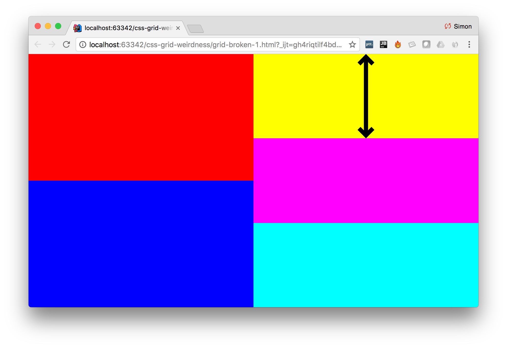
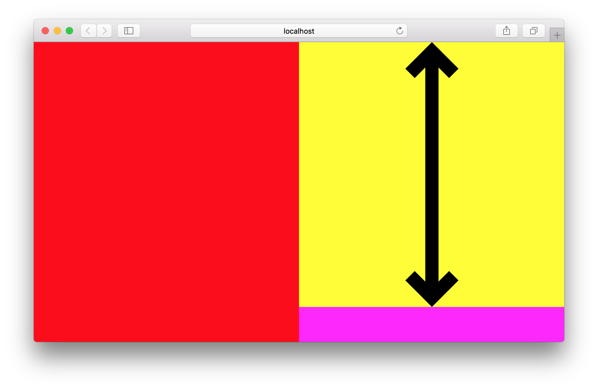
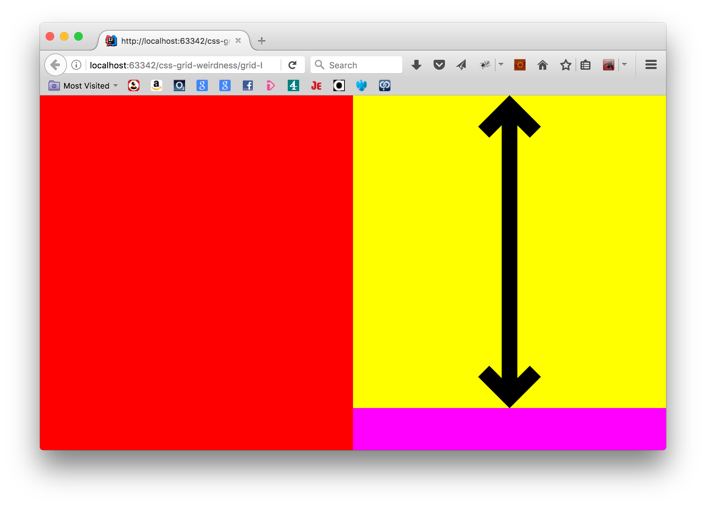
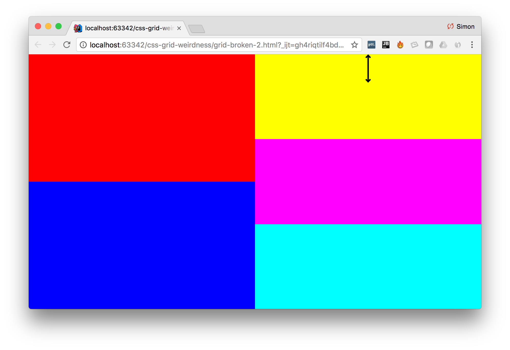
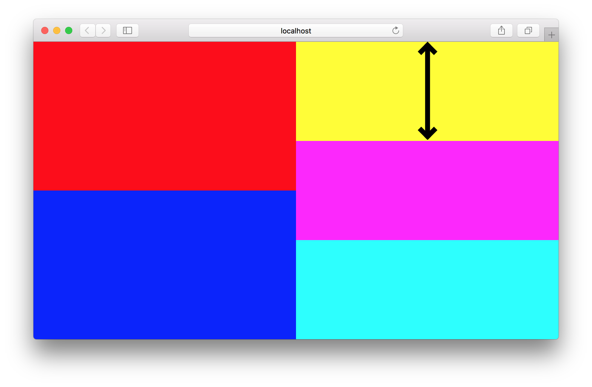

Firefox and Safari seem rather confused about the height of the contents of grid elements.

[This](grid.html) nicely coloured grid looks great until you try and fill it with stuff.

!(happy-grid.png)

[This](grid-broken-1.html) is fine in Chrome, but odd in Safari and Firefox (in the same way)

Chrome 57

Safari 10.1

Firefox 53.0

[This](grid-broken-1.html) is even weirder - it does what you might expect in Chrome, fixes Safari assuming it's behaving differently, and ends up particularly weird in FF.

Chrome 57

Safari 10.1

Firefox 53.0

!(grid-broken-2-ff.png)

¯\\_(ツ)_/¯
